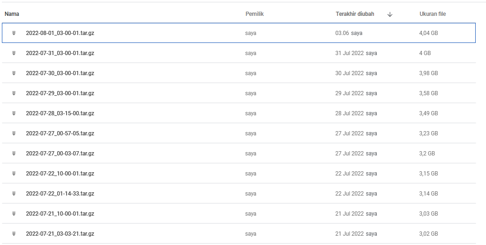

# Minecraft Auto Backup & Upload to GDrive
This is a script to back up the minecraft server world and plugins (spigot) and upload it to Google Drive automatically.


Save it to Google Drive:


## Prerequisites
* Running a Minecraft Server
* Installed and intialized [gdrive-CLI](https://github.com/prasmussen/gdrive)

## Installation
1. Download both script [backup_n_upload.sh](backup_n_upload.sh) and [backup.sh](backup.sh).
2. Place it on a folder. i.e backup
3. Change the configuration on *backup.sh*
   ```bash
    FOLDER_ID="<drive folder id>"
    MINECRAFT="<fullpath of minecraft server folder>"
    BACKUP="<fullpath of backup folder>" 
   ```
4. Install the cron job for automatic backup. i.e I'm automatic backup for every 3AM.
    ```bash
    0 3 * * * <full backup path>/backup_n_upload.sh >> <full backup path>/backup.log 2>&1
    ```
5. You're done.

## Note
You can change this line args on *backup_n_upload.sh*
```bash
$BACKUP/backup.sh -c -i $WORLD -i $WORLD_NETHER -i $WORLD_THE_END -i $PLUGINS -o $WORLD_OUTPUT -s minecraft -p Attention -m 3 -d sequential
```
Change it based ur matched preferences. For the detail of the args, check on [minecraft-backup usage](https://github.com/nicolaschan/minecraft-backup#usage)

## 3rd Party App
Thanks to these app that made this script powerfull :)
* [gdrive by prasmussen](https://github.com/prasmussen/gdrive)
* [minecraft-backup by nicolaschan](https://github.com/nicolaschan/minecraft-backup)
